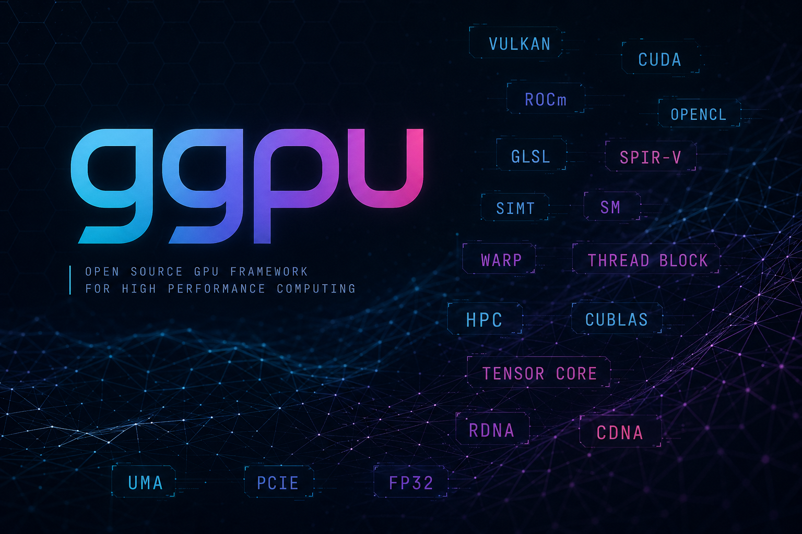
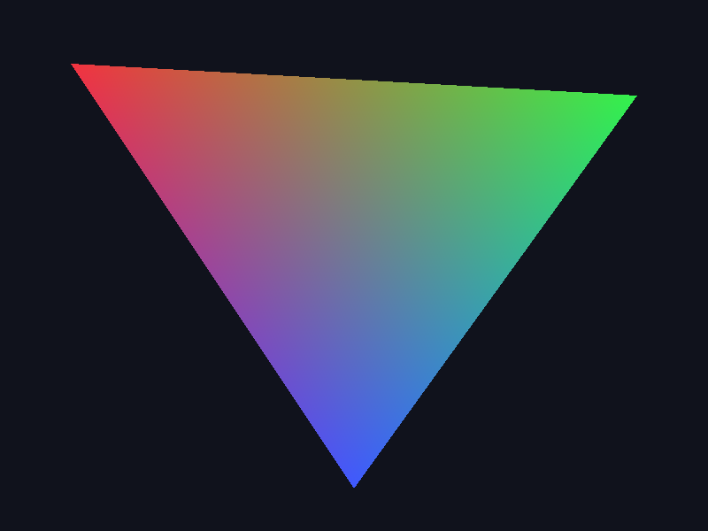
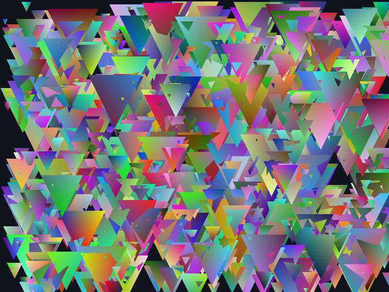
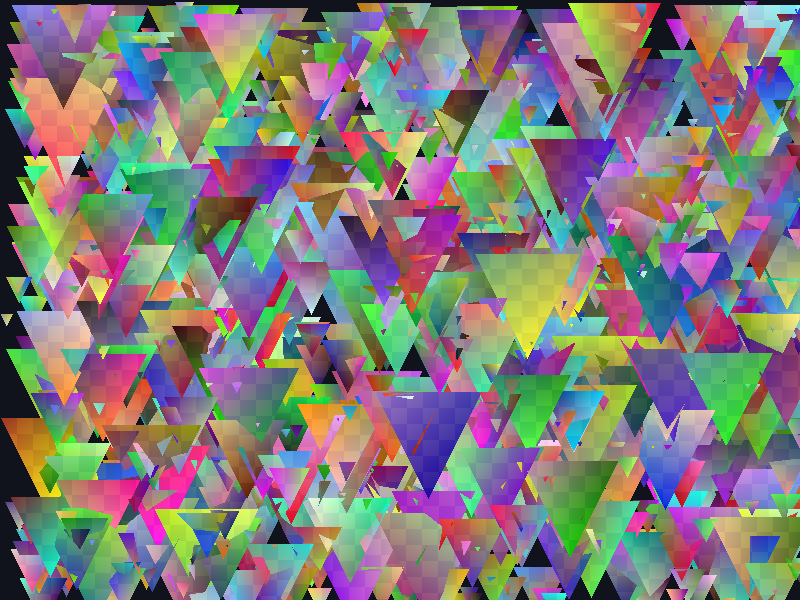

# ggpu — educational software rasterizer (Go)

[](https://github.com/hrodrig/ggpu/actions/workflows/ci.yml)
[](LICENSE)
[](https://go.dev/dl/)
[](https://github.com/hrodrig/ggpu/releases)
[](.github/workflows/ci.yml)
[](.github/CODEOWNERS)

## Summary

**ggpu** is a **CPU-based**, **classroom-oriented** software rasterizer in **Go**: a deliberately small **graphics pipeline** (vertices → raster → fragments) with **Go functions** as shaders, optional **depth**, and **PNG** or **live web preview** output. **`ggmat`** is a companion **CSV matrix** CLI for linear-algebra teaching (`add`, `mul-ew`, `matmul`, `identity`, `dot`). The repo doubles as a **template** for CI, coverage, container scanning, and reproducible builds.

- **[Releases](https://github.com/hrodrig/ggpu/releases)** — versioned tags, notes, and artifacts (including container images on GHCR when published).
- **Version source:** [`VERSION`](VERSION) (SemVer); **`ggpu -version`** prints git metadata when link-built ([`Makefile`](Makefile), [CI](.github/workflows/ci.yml)).
- **Scope:** graphics **pedagogy**, not a CUDA/SIMT emulator — see [`docs/TEACHING.md`](docs/TEACHING.md).

Docs and slides are **English** so you can adapt `docs/PRESENTATION.md` and `docs/slides.md` locally.

## Table of contents

- [Engineering, security, and DevSecOps](#engineering-security-and-devsecops)
- [Features](#features)
- [Requirements](#requirements)
- [Quick start](#quick-start)
- [Library usage (sketch)](#library-usage-sketch)
- [Project layout](#project-layout)
- [Build and develop](#build-and-develop)
- [Docker](#docker)
- [CI (summary)](#ci-summary)
- [Documentation index](#documentation-index)
- [License](#license)



## Engineering, security, and DevSecOps

*Clone this, keep the bar:* this repository is a **template of practices** you can copy into your own course or product work. The goal: **readable code**, **reproducible builds**, and **verifiable** supply-chain hygiene—not checkbox compliance alone.

| Practice | What we do | Why it matters / how to adapt |
|----------|------------|--------------------------------|
| **CI (GitHub Actions)** | [`.github/workflows/ci.yml`](.github/workflows/ci.yml) on push/PR to `main`/`master`: job **`lint`** (`make lint`, `make gocyclo`); **`go-linux-amd64`** job — `go test -race`, **merged coverage (≥ 80%)**, optional **Codecov** upload, native **`ggpu`/`ggmat`** build, cross-compile, **`govulncheck`**, **Docker** + [Grype](#container-image--grype); **`go-linux-arm64`** — race tests + native **`ggpu`/`ggmat`** build. Go version from **`go.mod`**. | Catches style bugs, data races, **regressions in test breadth**, dependency CVEs, image CVEs, and build issues on two Linux architectures. **Forks:** set branch filters and runner labels to match your org (private orgs may lack free `arm` runners). |
| **Vulnerability scans (Go)** | **`govulncheck ./...`** in CI (and `make vulncheck` locally) uses the Go team’s database for **known issues in the stdlib and your module graph** (here: no third-party modules; still valuable for the toolchain you pin in `go.mod`). | This is *application-level* and **complements** a container scan—it does not replace it. |
| **Container image (Grype)** | After `docker build`, **Grype** runs with **`--fail-on high`**: the pipeline **fails** on **High** or **Critical** findings in **image layers** (base OS + files). | Distroless reduces attack surface; scanning still matters when bases change. **If** a base lags, bump the image, pin by digest, or (last resort) document an exception. |
| **Cyclomatic complexity (gocyclo)** | **`gocyclo -over 14`**—every function must have complexity **&lt; 15** (see [`Makefile`](Makefile) `gocyclo` target). | Forces decomposition of hot paths; easier reviews and tests. |
| **Test coverage (atomic)** | After the **race** run, CI runs another `go test` with **`-coverpkg=./...`** so coverage is **merged across all packages** (library + `cmd/ggpu`). The **merged** statement total must be **≥ 80%** (`make cover` and CI enforce the same floor). | `go test -race` cannot combine with `-cover`; splitting runs is standard. Upload `coverage.out` to Codecov/Coveralls if your org wants history and PR annotations. |
| **Multi-arch Linux** | CI **cross-compiles** and has a native **arm64** job; the **Dockerfile** is **Buildx**-friendly for `linux/amd64` and `linux/arm64`. | Matches common cloud/edge and classroom laptops (Apple Silicon building Linux images). |
| **Container: rootless, minimal** | **Multi-stage** build; final stage is **gcr.io/distroless/static-debian12:nonroot** (unprivileged user, no shell). Binary is static (`CGO_ENABLED=0`) and the entrypoint is **`/usr/local/bin/ggpu`**. | **Least privilege** and small runtime image—closer to production hygiene than `FROM ubuntu` + `root`. **Fork:** if you add shell debugging, do it in a `debug` target, not the default image. |
| **Licensing (MIT)** | [LICENSE](LICENSE) is the **MIT** text; **include** the copyright notice in copies. | Lets others reuse the material in courses. **You** can adjust the first line to your name or org when you fork. |
| **CODEOWNERS** | [`.github/CODEOWNERS`](.github/CODEOWNERS) — replace **`@hrodrig`** with your team so reviews route correctly. | Optional but **recommended** on shared repos. |
| **Reproducible version strings** | The [`VERSION`](VERSION) file (e.g. `0.1.0`) and **git** metadata are injected with **`-ldflags -X main....`** at `make build` and in **Docker/CI** via build-args. Run **`ggpu -version`**. | Ties **artifacts** to **source**; essential for support and incident triage. |

**Adopting in your own repo (checklist):** enable branch protection, require CI green + review from **CODEOWNERS**, keep **`VERSION`** bumped for releases, run **`grype`/`trivy`** (or your org’s scanner) in CI, and add **SBOM** generation if your policy asks for it (e.g. `syft` + attach to releases).

## Features

- Indexed **triangle list** rendering (`DrawIndexed`)
- **Row-major** `MVP` transform (`Ortho2D`, `Vec4Transform`)
- **Perspective-correct** color interpolation in the rasterizer (via *1/w*)
- Optional **depth buffer** (less-equal; smaller depth wins for the current mapping)
- **Rasterization modes:** by default, each 16×16 screen tile is processed in a **separate goroutine**; optional **sequential** per-tile loop on one goroutine (`Config.SequentialTileRaster`); optional **debug tile** checkerboard on tile boundaries (`Config.DebugShowTileWorkload`) for teaching
- **`image/png`** export for demos and assignments
- Optional **live preview** (`-output live-web`) served on a local browser canvas

## Requirements

- Go **1.26.2** (`go` / `toolchain` in [`go.mod`](go.mod); `CGO` not required: pure Go, static-friendly builds)
- **First-class target platforms (Linux):** `linux/amd64`, `linux/arm64` (CI cross-builds and runs tests on both). Other `GOOS`/`GOARCH` combinations are best-effort as long as the Go toolchain and standard library support them.

## Quick start

```bash
go run ./cmd/ggpu -w 800 -h 600 -t 0   # default PNG: work/demo.png
go run ./cmd/ggpu -output live-web -listen 127.0.0.1:8080 -max-fps 30
# Version info only matters on a link-built binary:
make build && ./bin/ggpu -version
```

### Example renders (PNG)

The table below uses **committed reference images** in [`docs/assets/`](docs/assets/) (what you see on GitHub). When you run the demo locally, write outputs under **`work/`** (ignored by git) so your PNGs stay out of the documentation tree.

| Default gradient triangle | Stress (`-stress 1000`) | Debug tiles (`-debug-tiles`) |
|:---:|:---:|:---:|
|  |  |  |

Same modes at **800×600** into your **`work/`** directory:

```bash
mkdir -p work
go run ./cmd/ggpu -w 800 -h 600 -out work/demo.png
go run ./cmd/ggpu -w 800 -h 600 -stress 1000 -out work/stress.png
go run ./cmd/ggpu -w 800 -h 600 -debug-tiles -out work/tiles.png
```

### CLI flags (demo / `ggpu` binary)

- `-version` — print version from `VERSION`, git **short** commit, and branch, then exit
- `-output` — output mode: `png` (default) or `live-web`
- `-w`, `-h` — framebuffer dimensions
- `-out` — output PNG path (default **`work/demo.png`**; parent dir is created if missing)
- `-listen` — listen address for `live-web` mode (default `127.0.0.1:8080`)
- `-max-fps` — preview refresh target for `live-web` mode (default `30`)
- `-open-browser` — open `live-web` URL in the default browser
- `-t` — sets the `TimeSeconds` uniform (small tint in the demo fragment shader)
- `-sequential-tiles` — one goroutine per draw for tile raster (`Config.SequentialTileRaster`)
- `-debug-tiles` — show subtle color bias on 16×16 tile edges (teaching; `Config.DebugShowTileWorkload`)
- `-stress` — draw many random triangles (rough performance smoke test)

### Live preview notes and troubleshooting

- Demo video (short): [`docs/assets/live-preview-short.mp4`](docs/assets/live-preview-short.mp4)
- Full capture: [`docs/assets/live-preview-small.mp4`](docs/assets/live-preview-small.mp4)
- `-output live-web` keeps rendering until you press `Ctrl+C`.
- If `-listen` is already in use, change it (example: `-listen 127.0.0.1:8090`).
- Use lower `-max-fps` values on constrained machines to reduce CPU load.
- If the browser does not open automatically, omit `-open-browser` and open the printed URL manually.

### Tool: `ggmat` (dense matrix ops, teaching CLI)

**`ggmat`** is a small **companion** command for **host → compute → host** workflows: read **CSV matrices** (row-major), run an **action** with **chunked parallelism** (`-vcores`), and write a CSV result (or print a scalar for **`dot`**). It is **not** a graphics API; it is a **concrete** way to exercise **same-shape** vs **matmul** vs **vector dot** semantics alongside the ideas in [`docs/TEACHING.md`](docs/TEACHING.md).

**Build:**

```bash
make build-ggmat   # → bin/ggmat
```

**Flags:**

| Flag | Meaning |
|------|---------|
| `-a` | Matrix **A**: path to a CSV file, or **`-`** for stdin |
| `-b` | Matrix **B** (required for every action except **`identity`**) |
| `-action` | One of: **`add`**, **`mul-ew`**, **`matmul`**, **`identity`**, **`dot`** |
| `-vcores` | Number of worker goroutines; **`0`** means `min(64, NumCPU)` |
| `-sep` | CSV column separator (exactly **one** character; default **`,`**) |
| `-out` | Output CSV path for matrix results (default **stdout**); ignored for **`dot`** |

**Actions (exact semantics):**

| Action | Needs `-b`? | Result |
|--------|-------------|--------|
| **`add`** | yes | `C[i,j] = A[i,j] + B[i,j]` — **same shape** as `A` and `B` |
| **`mul-ew`** | yes | **Element-wise** product: `C[i,j] = A[i,j] * B[i,j]` — same shape |
| **`matmul`** | yes | `C = A B` with **`A`** of shape **M×K** and **`B`** **K×N** → **`C`** **M×N** |
| **`identity`** | no | Deep copy of **`A`** (`-b` is not used) |
| **`dot`** | yes | Scalar **dot product**; **`A`** and **`B`** must each be **1×N** or **N×1** with the **same** `N` |

**Examples:**

```bash
# Element-wise multiply (same length / shape)
printf '1,2,3\n' > /tmp/a.csv
printf '4,5,6\n' > /tmp/b.csv
./bin/ggmat -a /tmp/a.csv -b /tmp/b.csv -action mul-ew -vcores 8

# Matrix multiply: write result to a file
printf '1,2\n3,4\n' > /tmp/m.csv
printf '1,0\n0,1\n' > /tmp/n.csv
./bin/ggmat -a /tmp/m.csv -b /tmp/n.csv -action matmul -out /tmp/mn.csv

# Dot product (row vector × column vector)
printf '1,2,3\n' > /tmp/u.csv
printf '2\n3\n4\n' > /tmp/v.csv
./bin/ggmat -a /tmp/u.csv -b /tmp/v.csv -action dot
# prints one number to stdout (e.g. 20 for 1*2+2*3+3*4)

# Copy A (no -b)
./bin/ggmat -a /tmp/a.csv -action identity -out /tmp/a-copy.csv
```

**Notes:**

- **CSV format:** one **row** per line; values separated by `-sep`. Empty lines are skipped. All rows must have the **same** number of columns.
- **`matmul`:** if inner dimensions do not match (`cols(A) ≠ rows(B)`), the command **fails** with a clear error.
- **`dot`:** if either operand is **not** a single row or single column, the command fails (no implicit flatten of an arbitrary **M×N** grid).
- **Shell tip:** avoid bracket-heavy flags; **files** or **quoted** CSV strings piped with **`-a -`** are easier to script than embedding `[1,2,3]` in argv.

## Library usage (sketch)

```go
g := ggpu.New(ggpu.Config{
	Width: 800, Height: 600, DepthTest: true,
})
g.SetShaders(myVertexShader, myFragmentShader)
var u ggpu.UniformBuffer
u.ModelViewProjection = ggpu.Ortho2D(0, 800, 600, 0, -1, 1)
g.SetUniforms(&u)
g.Clear(ggpu.Color{R: 20, G: 20, B: 30, A: 255})
g.DrawIndexed(vertices, indices)
_ = g.WriteFramebufferPNG(os.Stdout)
```

The library is under `pkg/ggpu`; the **`ggpu`** command lives in `cmd/ggpu` and is the sample renderer.

## Project layout

| Path | Description |
|------|-------------|
| `VERSION` | SemVer string for release and `ldflags` (read by `make`, CI, Docker) |
| `pkg/ggpu` | Public API and rasterizer engine |
| `pkg/ggmat` | Dense matrix helpers used by **`ggmat`** (parse CSV, parallel ops) |
| `cmd/ggpu` | `main` for the **`ggpu`** CLI (PNG demo) |
| `cmd/ggmat` | **`ggmat`** CLI: `add`, `mul-ew`, `matmul`, `identity`, `dot` |
| `docs/` | Architecture, teaching notes, presentation material, Marp slides |
| `.github/CODEOWNERS` | Default review routing (edit when you fork) |
| `.github/workflows/ci.yml` | Lint job + amd64 (test, coverage, builds, govulncheck, Grype) + arm64 |
| `SECURITY.md` | Threat model and scanning notes |
| `LICENSE` | **MIT** |

## Build and develop

Running **`make`** with no target shows help. **`make build`** produces **`bin/ggpu`**, embedding **`VERSION`** and **git** metadata (when available).

```bash
make fmt          # gofmt -w
make lint         # gofmt -l + go vet (read-only; matches CI)
make vet          # go vet
make test         # go test -race
make cover        # coverage → coverage.out (no -race; see table above)
make gocyclo      # reject functions with complexity ≥ 15
make build        # bin/ggpu with version/commit/branch
make build-ggmat   # bin/ggmat (matrix teaching CLI; no extra ldflags)
make install                 # install(1) both → $(DESTDIR)$(BINDIR) (default BINDIR=/usr/local/bin)
make install ggpu            # only ggpu
make install ggmat           # only ggmat
make install DESTDIR=/tmp/stage   # staging tree, e.g. /tmp/stage/usr/local/bin/…
make all          # fmt, vet, test, gocyclo, cover, build
make ci           # lint, test, gocyclo, cover (no binary build)
make release-check   # semver, goreleaser, lint, test, security (optional: STRICT_RELEASE=1 docker-scan)
```

**Cross-compile (Linux) from any host with Go:**

```bash
make build-linux-amd64
make build-linux-arm64
```

**Vulnerability scanning (Go, local):**

```bash
make govulncheck   # or: make vulncheck (alias); uses go run, no prior install
```

**Container image (Grype, local):** build **`ggpu:local`** then scan the image (closest to CI). If **`grype`** is not installed, the Makefile falls back to the **`anchore/grype`** container (needs Docker).

```bash
make docker-scan
```

**Workspace directory scan** (excludes `bin/`, `work/`, `dist/`):

```bash
make grype
```

**Cyclomatic complexity** — `make gocyclo` (fail if any function has complexity **≥ 15**).

**Coverage** — `make cover` runs merged coverage (`-coverpkg=./...`) and **fails** if the total statement coverage falls **below 80%** (requires `bc` for the threshold check). The same rule runs in GitHub Actions.

## Docker

The `Dockerfile` is **multi-arch** with Buildx. Build-args **`APP_VERSION`**, **`GIT_COMMIT`**, **`GIT_BRANCH`** should match your tree; **`make docker-build`** passes them from **`VERSION` + git**. The image runs the **`ggpu`** binary as a **non-root** user (distroless `nonroot` tag).

**Local single-arch:**

```bash
docker build -t ggpu:local .
# or: make docker-build
```

**Multi-arch (`linux/amd64`, `linux/arm64`):**

```bash
make docker-buildx
```

**Docker Compose:**

```bash
mkdir -p work
docker compose up --build ggpu-live
# open http://127.0.0.1:8080 for live preview
```

```bash
mkdir -p work
docker compose run --rm ggpu-png
# → work/demo.png (host ./work is mounted at container /work)
```

```bash
docker compose down
```

## CI (summary)

- **linux/amd64:** parallel **`lint`** job (`make lint`, `make gocyclo`); **`go-linux-amd64`** job — race tests, **merged coverage ≥ 80%**, optional **Codecov**, **native `ggpu`/`ggmat` build** + `-version`, **cross-compile `ggpu` + `ggmat`** (linux/amd64, linux/arm64), **`govulncheck`**, **Docker** `ggpu:ci`, **Grype** (`--fail-on high`). Go version from **`go.mod`**.
- **linux/arm64:** test with race, native **`ggpu`** (version metadata) + **`ggmat`** build.

If **Grype** flags **High/Critical** in a base image, update the image or your policy. **GitHub** `arm` runners are typically available for **public** repositories.

## Documentation index

- [`docs/README.md`](docs/README.md) — full doc index
- [`docs/ARCHITECTURE.md`](docs/ARCHITECTURE.md) — diagrams, pipeline, limits
- [`docs/TEACHING.md`](docs/TEACHING.md) — graphics vs compute
- [`docs/PRESENTATION.md`](docs/PRESENTATION.md) & [`docs/PRESENTER_GUIDE.md`](docs/PRESENTER_GUIDE.md) — talk scripts and Q&A
- [`docs/STUDENT_QUICKSTART.md`](docs/STUDENT_QUICKSTART.md) — short student how-to
- [`docs/slides.md`](docs/slides.md) — Marp slides

## License

Distributed under the **MIT** license: see [LICENSE](LICENSE). Keep the **copyright and permission** notice in copies and derivatives.
