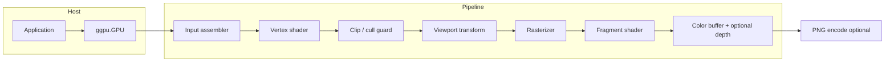
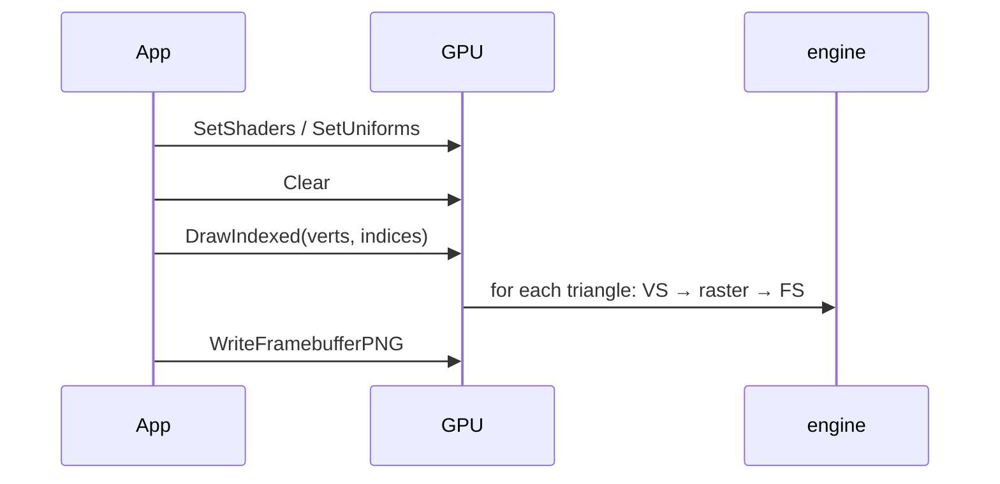

[← Back to main README](../README.md)

# Architecture

## High-level data flow

## Module layout

| Path | Role |
|------|------|
| `pkg/ggpu` | Public API: types, `GPU`, math helpers, PNG output. |
| `pkg/ggpu/rasterizer.go` | Unexported `engine`: framebuffer, depth, triangle rasterization. |
| `cmd/ggpu` | Minimal program: ortho projection, one indexed triangle; default PNG **`work/demo.png`**. |

**Design choice:** a **facade** (`GPU`) wraps an unexported **engine** so the public surface stays small (useful for classroom API reviews).

## Rasterization (implemented)

For each triangle after the vertex shader:

1. **Homogeneous divide** to NDC; **viewport** to pixel coordinates (origin top-left, *Y* down).
2. **Signed area** in 2D; if negative, **swap** two corners so winding matches the half-space tests (Y-down screens often yield a negative signed area for the same 3D winding).
3. **Bounding box** scan; for each pixel center, **three edge functions** give barycentric weights.
4. **Perspective-correct** attribute interpolation: interpolate *(a / w)* and *(1 / w)*, then divide (standard trick).
5. **Depth test** (optional): keep the closer fragment (`depth` buffer stores *closer = smaller* value for the current mapping).

## Coordinate systems

- **Clip space:** `VertexOutput.ClipPos` with *W* > 0 for the simple guard used in this project.
- **NDC:** *x, y, z* after division by *W* (roughly in [-1, 1] for what we accept).
- **Pixel space:** integer grid; subpixel centers use *+0.5* offsets for stable inside tests.

## Row-major transforms

`UniformBuffer.ModelViewProjection` is a **row-major** 4×4 matrix. The helper `Vec4Transform` applies **v′ = v × M** (row vector on the left). `Ortho2D` matches that layout: translations live in the **fourth column** of the top three rows (not in a mistaken row that would break *W*).

## Sequence: one draw call

## Clipping and depth (explicit)

- There is **no Sutherland–Hodgman (or similar) clipper** against the frustum. The implementation uses a small **“guard”** in clip space: vertices with *W* ≤ 0 or NDC *x, y, z* roughly outside a loose band (about ±1.1 in the code) cause the **whole triangle** to be **discarded** (`clipValid` in `rasterizer.go`). That means partially visible triangles (spanning the guard boundary) are **dropped entire**, not cut. The README and teaching notes say “clip” colloquially; the behavior is *cull early*, not *clip* in the API sense. For a classroom sound bite: *“It is only a simple guard; a full clipper would be a separate implementation exercise.”* See also `docs/PRESENTER_GUIDE.md` for consistent phrasing when you present.

- **Depth** is stored in **view-space mapping** after the viewport: `ndcZ*0.5+0.5` into a buffer where **smaller** values win the depth test. That matches the `>` comparison used in the raster; do not quote OpenGL D24S8 details—quote this project’s doc or code.

- **Stencil** is **not** implemented. `GPU.Clear` only updates color and, when `DepthTest` is set, the depth buffer. There is no separate stencil array.

## Raster scheduling (teaching)

- The bounding box of each triangle is split into **16×16 pixel tiles** (same window size, not a hardware tile binning tree).

- **Default (`Config.SequentialTileRaster == false`):** each tile is processed in a **new goroutine**; `sync.WaitGroup` waits for the triangle’s tiles. This is a **teaching** illustration of *many* independent work items, not a real GPU’s warp scheduler or a tuned CPU tile renderer. Large triangles can schedule **many** goroutines at once.

- **Optional (`Config.SequentialTileRaster == true`):** the same math runs in **nested for loops in one goroutine** (no per-tile goroutine). This reduces scheduler overhead, makes CPU profiles easier to read, and keeps `-race` tests deterministic when the test pins sequential mode. A **fixed-size worker pool** is *not* implemented; you could add one as a future project.

- **`Config.DebugShowTileWorkload`:** when **true**, a **small checkerboard** is added in **fragment input color** (before the fragment shader) so 16×16 tile boundaries are visible. When **false** (default), that bias is off so the rest of the pipeline output is not altered. Use only for slides or “where did my warps go?” discussions.

## Other limitations (explicit)

- No **blending**; color is written **opaquely** (the framebuffer stores 8-bit RGBA; alpha is passed through, not used for compositing in the raster).
- **Not thread-safe**; one `GPU` per goroutine (for API calls) or external locking. Parallel tiles **within** a draw only touch **disjoint** pixels of the same buffers; the API still says “no concurrent *GPU* use” because other methods (`Clear`, `SetUniforms`, etc.) are not protected.

## Uniforms

- `SetUniforms(nil)` is a **no-op**: the previous `UniformBuffer` value is **retained** (struct copy in the engine). The first draw should use a non-nil buffer if the zero value of `UniformBuffer` is not what you want.

For pedagogy on *compute* GPUs, read `docs/TEACHING.md`.
